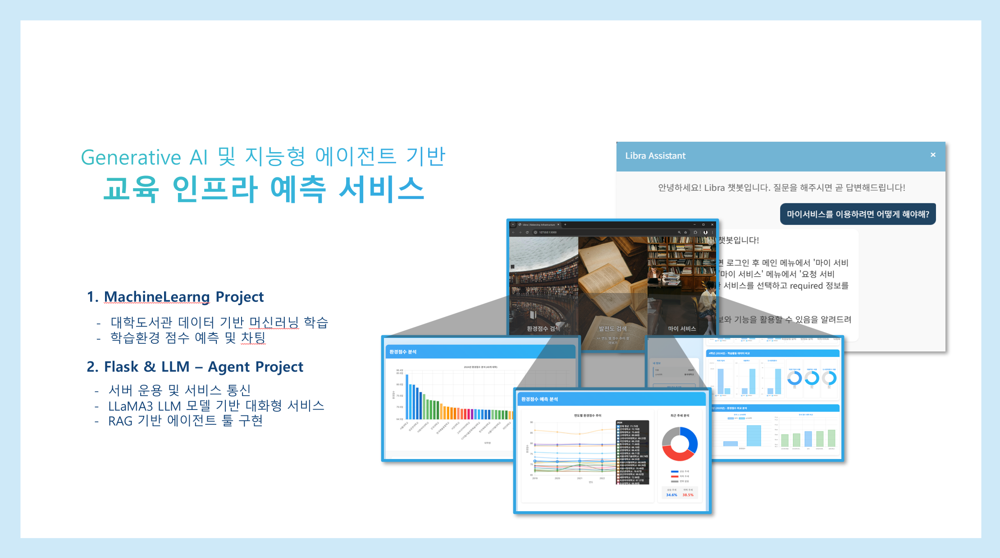

<!-- 헤더 배너 -->

  

<h1 align="center">Orbit-Libra • Project Libra</h1>

  Generative AI 및 지능형 에이전트 기반 교육 인프라 예측 서비스

  강승민, 김선희

---

## 프로젝트 소개
대학도서관 데이터를 통한 대학교 별 학습환경 예측 및 대화형 채팅 봇 서비스
- 각 대학교의 학습환경 점수 예측 및 미래점수 예측
- 유저 데이터 기반 학습도 예측 및 소속대학 & 유사점수 대학 비교 분석
- LangGraph 및 MCP를 활용한 AI 에이전트 구현

[프레젠테이션 슬라이드 전체보기](assets/프로젝트결과보고서_5조_강승민_ver.1.0.pdf)

[시연영상 시청(GitHub Pages)](https://orbit-libra.github.io/2nd_Project_LLM_Service/video.html)

## 주요 레포지토리
- 🔧 [2nd_Project_LLM_Service](https://github.com/Orbit-Libra/2nd_Project_LLM_Service) – Flask/LLM/Agent
- 🖥️ [1st_Project_MachineLearning](https://github.com/Orbit-Libra/1st_Project_MachineLearning) – MachineLearning/Frontend

